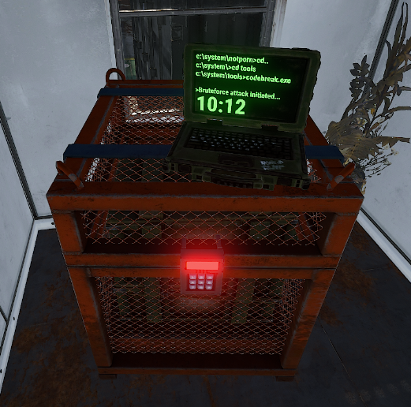
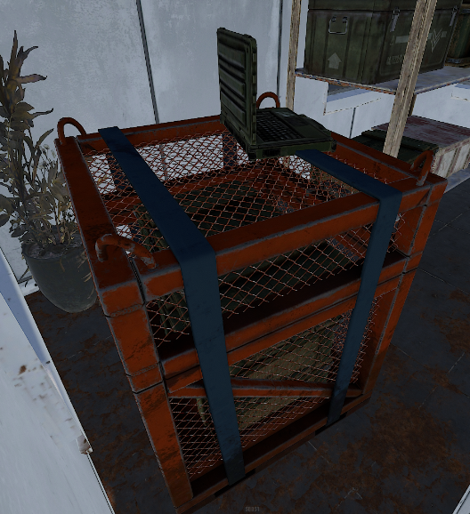
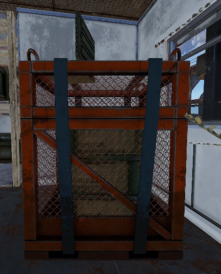
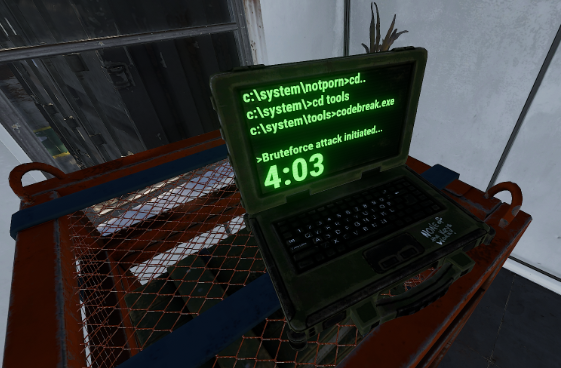
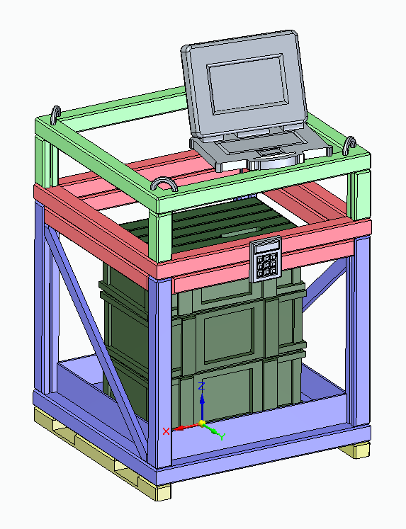
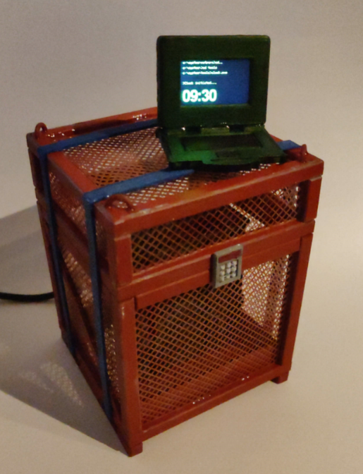
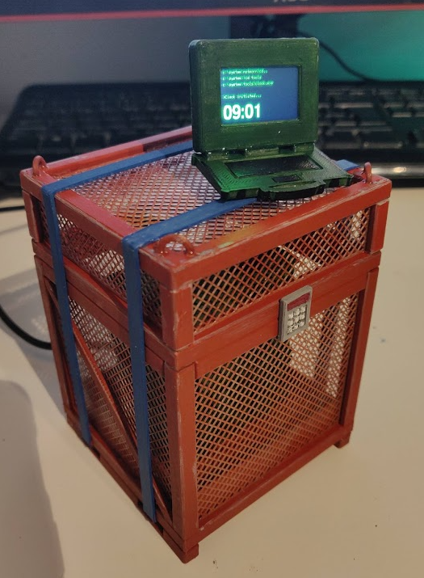
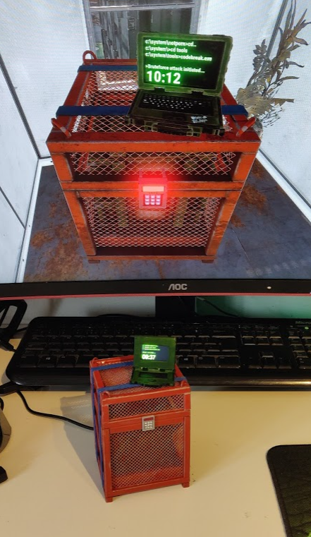

# Rust Locked Crate Model Replica

A working model replica of the locked crate from the game "Rust". 

In the game, there is a laptop on top of the crate that displays a countdown. For turning this into a replica model, I decided to replace this countdown with a clock to give it a real world use.

## Reference Images

Below are some screenshots that were used as a reference when 3D modelling the crate

## 3D Model

It is a fairly complex model to print so it needed to be split into several parts. 

Below is an image of the final 3D model, where each of the coloured sections are seperate individual parts, which can be printed without any support material. The stack of boxes in the middle are hollow and are used to house the electronics (Arduino + RTC module). A small LCD screen sits inside the laptop.

The side mesh pieces are not modelled in the same way - they are modelled as a flat plate and then turned into a mesh using a 3D printing trick. It is printed as infill to give a clean mesh  and then slots into the grooves in each side area. Modelling a thin mesh would be tricky to slice and print nicely, but using the slicer itself to create the mesh guarantees it will print well.

## Final Product

The printed model was painted and integrated with the electronics. The screen displays the current time in place of the in-game countdown.

